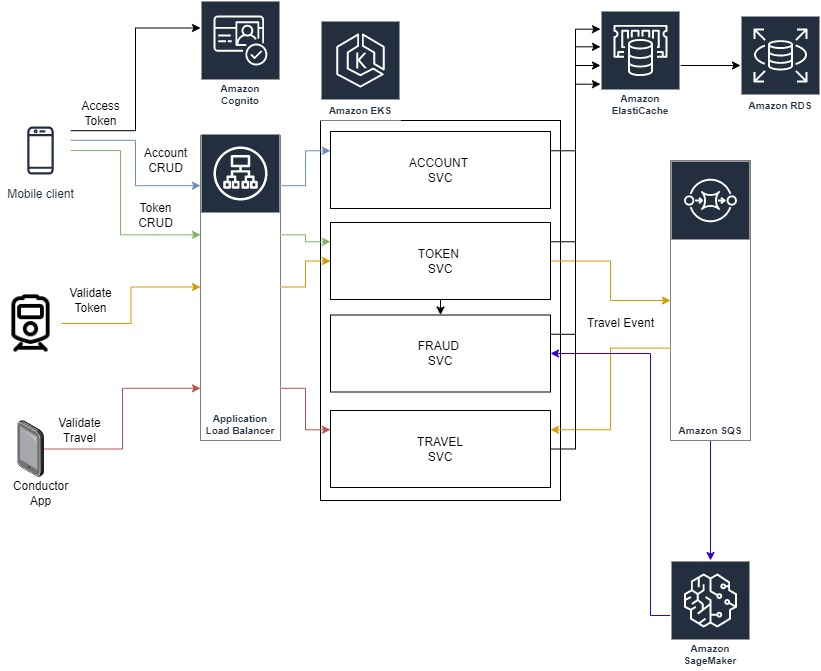

# Assumptions

Since context of this assignment has limited information. I made several assumptions. According to my assumptions, the business flow will be like the below.

* A user creates an account using a mobile or web client.

* They can then add payment methods such as a phone, card, or QR code. The ID of each payment method will be unique and
referred to as a token. These tokens belong to the specific user.

* When the user uses one of these tokens to open barriers in stations or check into buses and trams, the token will be
sent to the cloud and validated.

* The check-in event creates a ticket in the cloud, which is marked as completed when the user checks out.

* Additionally, during the design process, I assumed that, similar to an NS Flex membership, all tickets would be
accumulated on a monthly basis and managed by issuing a single invoice at the end of the month. I excluded the payment
service where this invoice would be paid from this design.

# High-Level Design

I prefer to use microservice architecture. I have 4 microservice to handle these business requirements.

* Account Service
* Token Service
* Fraud Service
* Travel Service

My preference is to use AWS as my cloud provider since I am more familiar with it. To handle the increased volume of
requests during peak hours, I have deployed these microservices to an AWS EKS cluster. By utilizing the autoscale
feature, the pod size will automatically adjust based on the amount of incoming traffic. Additionally, I have placed an
application load balancer in front of the Kubernetes cluster to distribute incoming traffic.

The mobile user obtains a JWT token from the Cognito User Pool and subsequently sends this token to the Account service.
All account-related operations, including CRUD operations, are handled by this service. I preferred to use ElastiCache
for caching, and Amazon RDS for the database. Amazon RDS Multi AZ is a solution for database failures.

Following the creation of an account, the user is required to create tokens such as a smartphone ID via NFC, a bank card
with NFC, or a QR code, which is managed by the Token Service. Once a token has been defined, the user can utilize it to
access barrier gates in stations and check in on buses and trams.

The Token service is also responsible for validating tokens, by verifying the incoming token ID and finding the
associated
account. To ensure the speedy processing of this task, I have chosen to keep all active token information in
ElastiCache. The token ID serves as the key and the associated account ID serves as the value. Given the scope of this
application, I do not anticipate this approach causing any issues. For instance, in the Netherlands alone, there are
approximately 15 million users of this application, each with two active tokens, resulting in a total of 30 million
records in Redis. If we store both the UUID key and value, we would require approximately 3-5 GB of space to store all
the information in the cache. This storage size is not huge. However, the validation operation will be very fast. But
also it needs extra effort to manage cache and db synchronization. It can be handled with caching strategies.

Following token validation, the Token service generates a travel event and places it into an SQS queue. The Travel
service consumes this event and creates a ticket. When check-out is initiated, another travel event is generated and
consumed by the Travel service, which then marks the travel as completed.

A conductor has also another application to validate travel to understand that the passenger has a valid check-in. It
uses the travel service to validate this information.

All events sent to the SQS are also routed to our Machine Learning and Analytics services for analysis to detect
potentially fraudulent activities, such as short-term check-ins at very distant locations.

To send tokens to the cloud, new train and bus companies must integrate with my Token service. However, the process of
defining and integrating security measures to validate these companies falls outside the scope of this design.

I have utilized distributed cache and database clusters, which makes it easy to implement failover handling mechanisms
such as multiple masters, as well as performance handling measures like read replicas.

Other AWS services like CloudWatch, WAF, etc can be used for logging, security, etc.

# Bus Connectivity  Problem

When buses experience intermittent connectivity issues, there may be disruptions in the connection to the cloud servers,
rendering instant validation temporarily unavailable. To address this, the machines located on the bus need to
accumulate all token validation requests during the disconnection period. When the connection is restored, the machines
will send the accumulated requests as batch requests. But still, someone can use the bus with some randomly generated QR
codes. Using some patterns and embedding these patterns into QR codes might be a solution. These patterns might be
checked on-premise without sending them to the cloud.

# Spring Boot Integration

To supply these features, I will use Spring Boot based microservices. Services will be RESTful. So Spring Web dependency
is required. There are lots of AWS integration so AWS SDKs are needed to import applications.

ZXing library can be used to generate QR Codes. As I mentioned I will keep all of these information in cache. So if a qr
code has a validity then it is put cache with TTL value.

While validating any token phone, card, and QR , token id will be sent to api with some supportive information like
timestamp, location or checkin device id. With these information the travel ticket either will be created or completed.

I wrote boilerplate code if TokenService and TravelService to show how mechanism will work. So my sample codes are not fully
working.